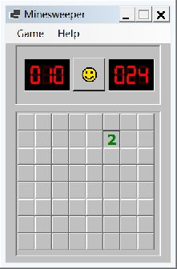

# IronRust

IronRust provides a RustScript runtime and compiler for Microsoft CLR.

## Quick start

```powershell
cargo build --locked --release --lib --manifest-path native/pd-vm-compiler/Cargo.toml
dotnet build IronRust.sln --configuration Release
```

Rebuild the native compiler after updating the repository. Source compilation
requires its VMBC format to match the CLR reader.

The native library contains the compiler and VMBC encoder. Edge ABI declarations
provide compile-time host schemas; Rust VM execution, HTTP/TLS implementations,
SQLite, and JIT are excluded from its production dependencies. Runtime parity
tests build in a separate target directory.

On Windows, launch the Minesweeper example with:

```powershell
.\run-minesweeper.bat
```



Run the native compiler and CLR tests with:

```powershell
cargo test --locked --target-dir native/pd-vm-compiler/target/parity-tests --manifest-path native/pd-vm-compiler/Cargo.toml
dotnet test IronRust.sln --configuration Release
```

## Documentation

- [IronRust reference](https://rustscript.org/docs/reference/ironrust/)
- [Runtime guides](https://rustscript.org/docs/learn/runtimes/#ironrust)
- [Runtime implementation guide](https://rustscript.org/docs/contribute/runtimes/#ironrust)
